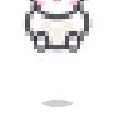

# noctalia-bunny-plugin-stella

A [Noctalia](https://github.com/noctalia-dev/noctalia-shell) v5 plugin source
repo containing **Bunny** — a cute pixel bunny that lives in your bar, made
for stella. It idles with a gentle breathing sway, hops on its own every so
often, and can be clicked to pause/rest or right-clicked to make it hop on
demand. Purely decorative, no external tools or permissions required.

<p align="center">
  
</p>

## Install

Add this repo as a plugin source in Noctalia, then enable **Bunny** and add
the `bunny` widget to a bar from the widget picker:

```sh
noctalia msg plugins source add stella-bunny git https://github.com/itzNOELdev/noctalia-bunny-plugin-stella
```

See [`bunny/README.md`](bunny/README.md) for widget usage, settings, and IPC.

## Repo layout

This follows the same source-repo shape as
[`noctalia-dev/official-plugins`](https://github.com/noctalia-dev/official-plugins):
one plugin per subdirectory (matching the part of its id after the `/`), plus
an auto-generated `catalog.toml` at the root so the plugin can be listed and
compat-checked without a full clone.

```
noctalia-bunny-plugin-stella/
  catalog.toml           # auto-generated, do not edit by hand (see below)
  bunny/
    plugin.toml           # manifest: identity, widget entry, settings schema
    bunny.luau             # the bar widget entry script
    assets/                # pre-rendered bunny sprite frames (idle/sitting/jump)
    translations/en.json   # setting labels/descriptions
    README.md
```

`catalog.toml` is rebuilt automatically by a GitHub Action
(`.github/workflows/update-catalog.py`) whenever `bunny/plugin.toml` changes
on `main` — don't edit it by hand.

## Editor setup

`noctalia.d.luau` declares the plugin API (`noctalia.*`, `barWidget.*`, `ui.*`,
entry callbacks, …) for editor autocomplete and typo diagnostics via
[luau-lsp](https://github.com/JohnnyMorganz/luau-lsp). `.vscode/settings.json`
and `.luaurc` already point at it and set `nonstrict` mode, matching the
`--!nonstrict` directive at the top of `bunny.luau`.

## Credits

- Bunny sprite and animation frames created for this plugin; motion timing
  (hop arc, settle, breathing sway) adapted from a bongocat-style bar-pet
  reference animation.
- Built against the [Noctalia plugin docs](https://noctalia.dev/v5/plugins/)
  and the [official-plugins](https://github.com/noctalia-dev/official-plugins)
  `bongocat` plugin as a structural reference.

## License

GPL-3.0 — see [LICENSE](LICENSE).
