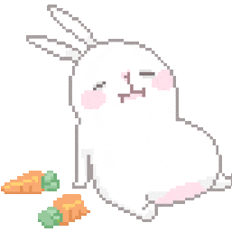
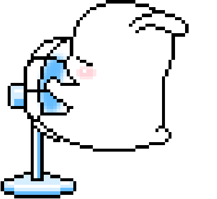
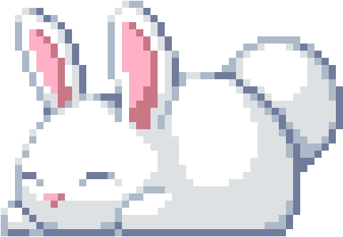

# noctalia-bunny-plugin-stella

A [Noctalia](https://github.com/noctalia-dev/noctalia-shell) v5 plugin source
repo containing **Bunny** — a cute bunny that lives in your bar and loops
through moods (eating, playing, sleeping, ...). Click it to move to the next
mood; right-click to pause. Purely decorative, no external tools or
permissions required.

<p align="center">
  
  
  
</p>

## Install

Add this repo as a plugin source in Noctalia, then enable **Bunny** and add
the `bunny` widget to a bar from the widget picker:

```sh
noctalia msg plugins source add stella-bunny git https://github.com/itzNOELdev/noctalia-bunny-plugin-stella
```

See [`bunny/README.md`](bunny/README.md) for widget usage, settings, IPC, and
— most importantly — how to add your own moods.

## Repo layout

This follows the same source-repo shape as
[`noctalia-dev/official-plugins`](https://github.com/noctalia-dev/official-plugins):
one plugin per subdirectory (matching the part of its id after the `/`), plus
an auto-generated `catalog.toml` at the root so the plugin can be listed and
compat-checked without a full clone.

```
noctalia-bunny-plugin-stella/
  catalog.toml              # auto-generated, do not edit by hand (see below)
  Makefile                  # `make build` -> tools/build_states.py
  tools/
    build_states.py          # turns assets/source_gifs/*.gif into playable states
  bunny/
    plugin.toml               # manifest: identity, widget entry, settings schema
    bunny.luau                 # the bar widget entry script — reads manifest.json,
                                # cycles frames on a timer, has no hardcoded mood list
    assets/
      source_gifs/               # your original GIFs, one per mood — eating.gif etc.
      states/                     # generated: per-mood extracted PNG frames + timing
        manifest.json               # ordered list of mood ids, regenerated on build
        eating/  playing/  sleeping/ # frame_NNN.png + meta.json per mood
    translations/en.json      # setting labels/descriptions
    README.md
```

Adding a mood is: drop a GIF in `assets/source_gifs/`, run `make build` (or
`python3 tools/build_states.py`), reload the widget. No Luau edits, no new
settings, no manifest hand-editing. Full details in
[`bunny/README.md`](bunny/README.md#adding-a-new-mood).

`catalog.toml` is rebuilt automatically by a GitHub Action whenever
`bunny/plugin.toml` changes on `main` — don't edit it by hand.

## Editor setup

`noctalia.d.luau` declares the plugin API (`noctalia.*`, `barWidget.*`, `ui.*`,
entry callbacks, …) for editor autocomplete and typo diagnostics via
[luau-lsp](https://github.com/JohnnyMorganz/luau-lsp). `.vscode/settings.json`
and `.luaurc` already point at it and set `nonstrict` mode, matching the
`--!nonstrict` directive at the top of `bunny.luau`.

## Why frames instead of playing the GIFs directly

Noctalia's widget image APIs only display static images — there's no
built-in animated-GIF playback. So `tools/build_states.py` decomposes each
GIF into a PNG frame sequence once, and `bunny.luau` steps through those
frames on a timer at runtime. End result still looks and feels like the GIF
looping; see [`bunny/README.md`](bunny/README.md#why-gifs-arent-played-directly)
for the full explanation.

## Credits

- Bunny GIFs (eating, playing, sleeping) supplied by the plugin author.
- Built against the [Noctalia plugin docs](https://noctalia.dev/v5/plugins/)
  and the [official-plugins](https://github.com/noctalia-dev/official-plugins)
  `bongocat` plugin as a structural reference.

## License

GPL-3.0 — see [LICENSE](LICENSE).
